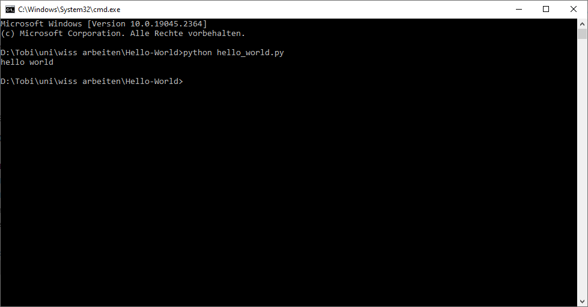

# Hello-World

Das "Hello World"-Programm soll die Welt grüßen.

Um die Datei auszuführen benötigen Sie einen Python-Interpreter

Führen Sie nun das Programm in ihrem Verzeichnis mit "python hello_world.py" in der Konsole aus.

